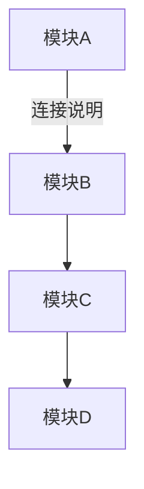
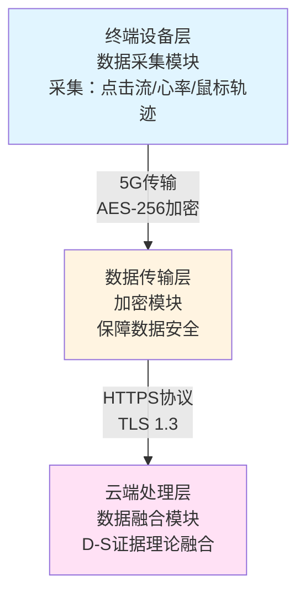
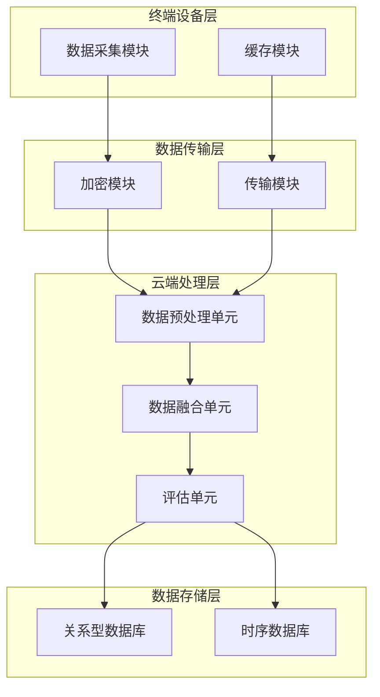
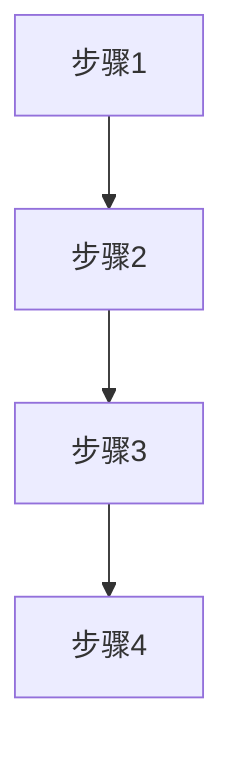
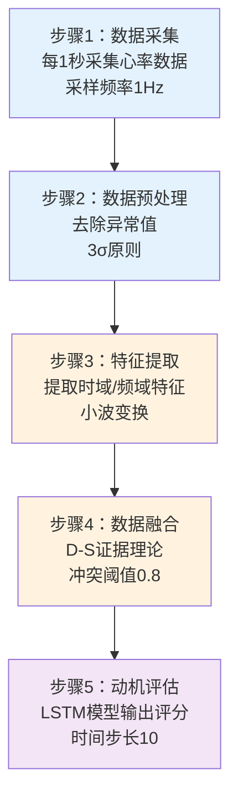
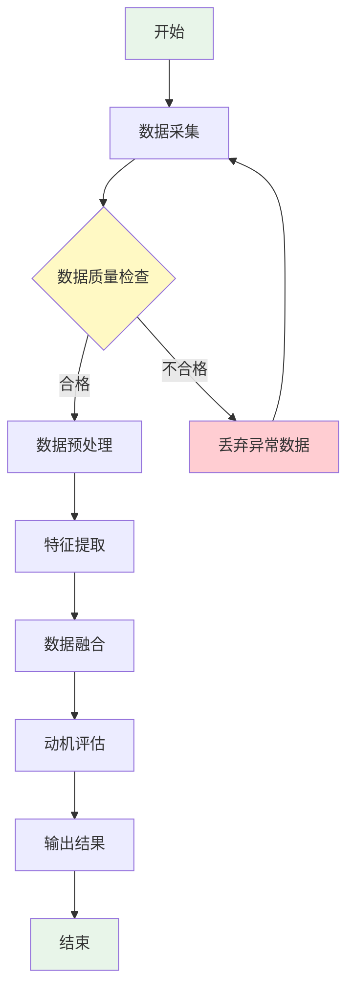
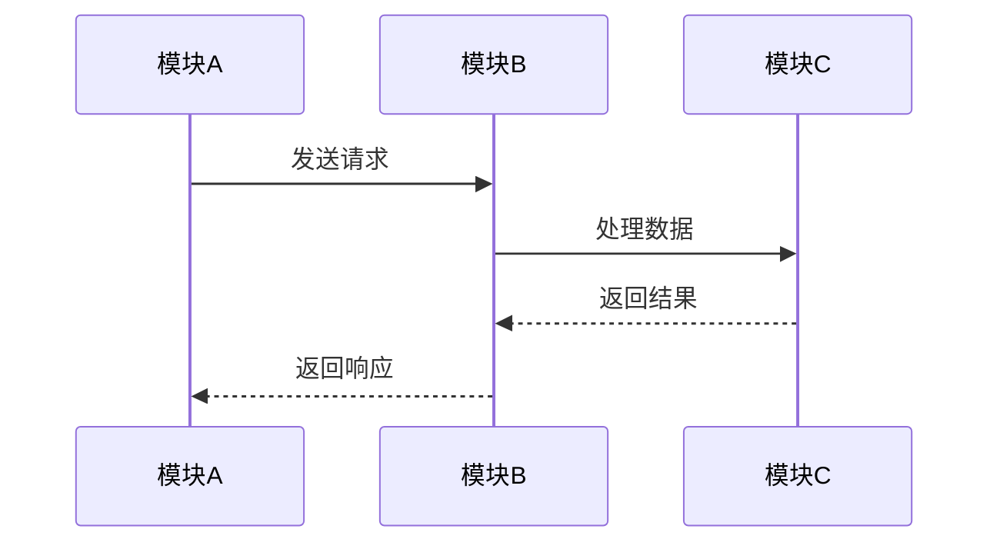
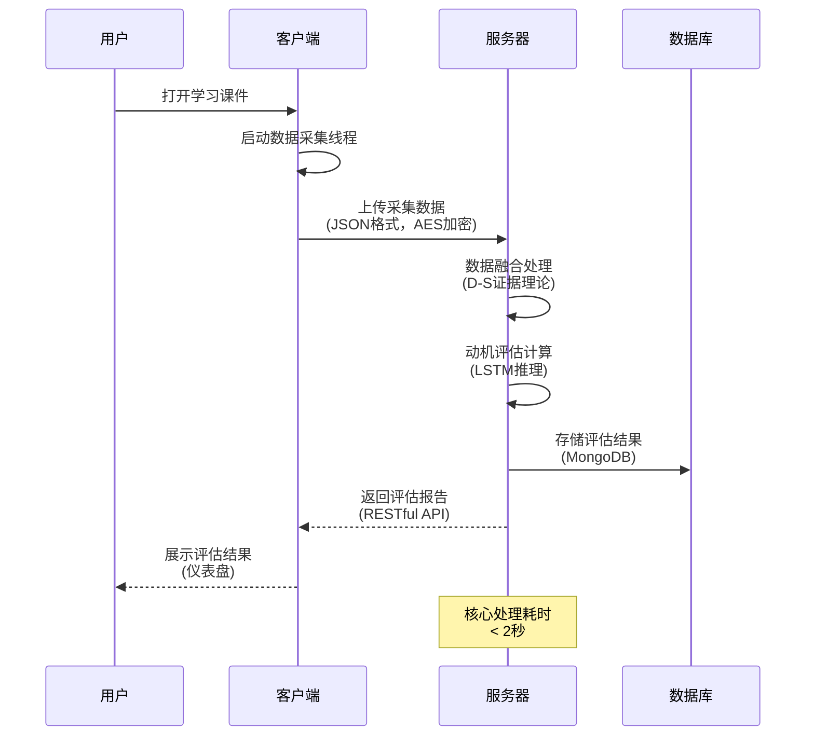
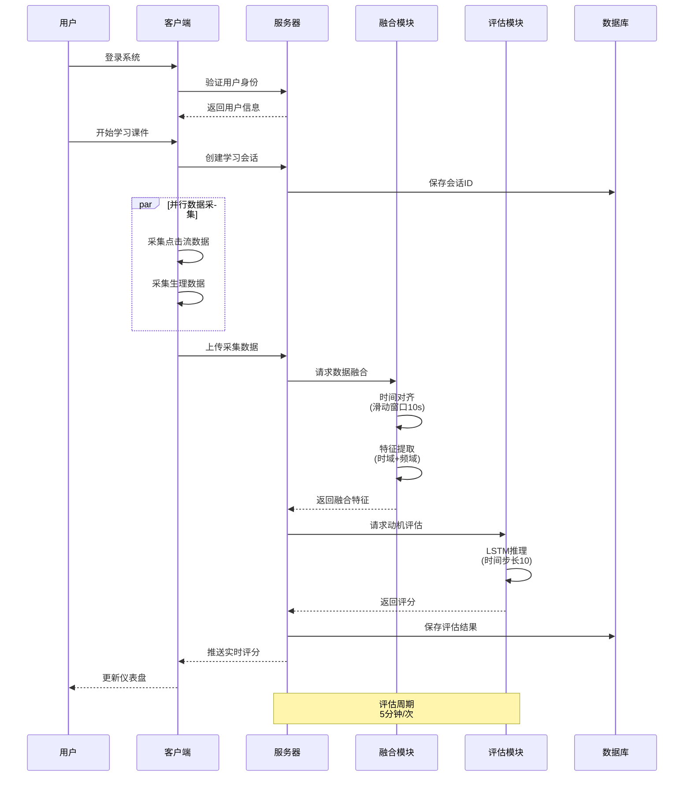

# Mermaid 附图绘制示例

本文件提供说明书附图和摘要附图的 Mermaid 代码绘制示例。

## 目录

- [图表类型说明](#图表类型说明)
- [系统架构图](#1-系统架构图)
- [方法流程图](#2-方法流程图)
- [模块交互时序图](#3-模块交互时序图)
- [绘制要点](#绘制要点)

---

## 图表类型说明

| 图表类型 | Mermaid 语法 | 适用场景 |
|---------|------------|---------|
| 系统架构图 | `graph TD` | 展示系统各层级模块及连接关系 |
| 方法流程图 | `flowchart TB` | 展示技术实现步骤流程 |
| 模块交互图 | `sequenceDiagram` | 展示各模块交互的时序关系 |

---

## 1. 系统架构图

### 基本语法



### 完整示例



### 层次化架构图



---

## 2. 方法流程图

### 基本语法



### 完整示例



### 带条件判断的流程图



---

## 3. 模块交互时序图

### 基本语法



### 完整示例



### 复杂交互场景



---

## 绘制要点

### 1. 模块/节点命名要求

**错误示例**（仅包含模块名称）：
```
A[数据采集模块]
B[数据融合模块]
```

**正确示例**（包含功能描述）：
```
A[数据采集模块<br/>采集点击流和心率数据<br/>采样频率1Hz]
B[数据融合模块<br/>采用D-S证据理论<br/>融合多源数据]
```

### 2. 连接关系标注

每条连接线应标注数据/信息类型：
```
A -->|JSON格式数据| B
A -->|AES-256加密| B
A -->|HTTPS协议| B
```

### 3. 颜色和样式

使用颜色区分不同类型的模块或步骤：
- 蓝色：输入/前端模块
- 黄色：处理/核心模块
- 紫色：输出/后端模块
- 绿色：开始/结束节点
- 红色：异常/警告节点

### 4. 图表简洁性

- 避免在单幅图表中展示过多信息
- 核心信息应一目了然
- 详细信息通过标注体现
