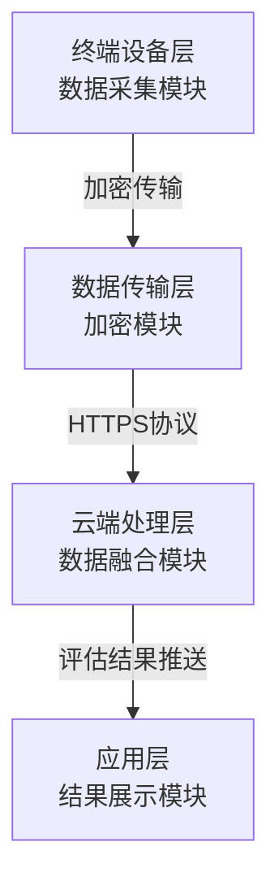
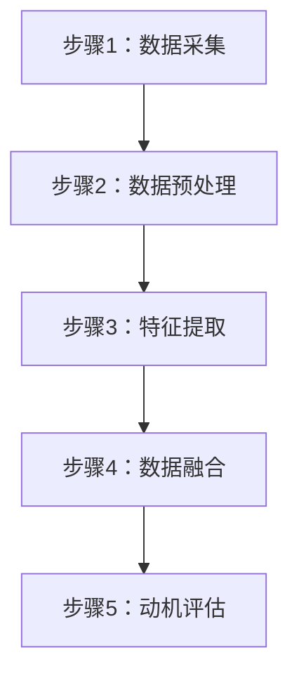
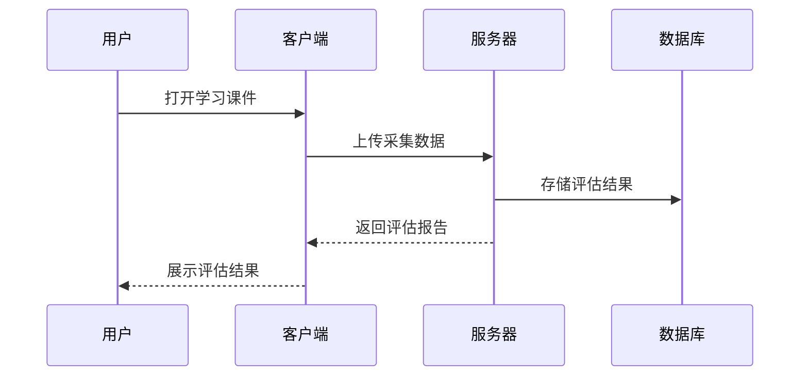

# 专利申请文件输出模板

本文件提供完整的专利申请文件输出格式模板。

## 目录

- [说明书模板](#说明书模板)
- [权利要求书模板](#权利要求书模板)
- [说明书摘要模板](#说明书摘要模板)
- [说明书附图模板](#说明书附图mermaid代码)
- [摘要附图模板](#摘要附图mermaid代码)

---

## 说明书模板

### 1. 技术领域

[细化至具体子领域，说明应用场景]

### 2. 背景技术

[描述3-5种现有技术，说明核心原理、技术流程、主要特点、技术局限性]

#### 2.1 现有技术1

[现有技术1的详细描述]

#### 2.2 现有技术2

[现有技术2的详细描述]

#### 2.3 现有技术3

[现有技术3的详细描述]

#### 2.4 技术痛点总结

[提炼现有技术未解决的共性问题]

### 3. 发明内容

#### 3.1 要解决的技术问题

[列出3-5个具体技术问题]

#### 3.2 技术方案

##### 3.2.1 整体架构

**硬件架构：**
[硬件架构描述]

**软件架构：**
[软件架构描述]

##### 3.2.2 核心组成模块

**模块1：[模块名称]**

功能定位：
- 该模块在整体技术方案中的作用
- 该模块要解决的具体技术问题
- 该模块的输入和输出

实现机制：
- 采用什么技术实现？（算法/硬件/协议）
- 技术原理是什么？
- 关键技术参数是什么？
- 为什么选择这个技术？

具体实现：
- 硬件实现：
- 软件实现：
- 算法流程：

**模块2：[模块名称]**

[按模块1的格式描述]

##### 3.2.3 关键技术特征

**主要解决技术问题的特征：**

1. [特征1]：[描述]
2. [特征2]：[描述]
3. [特征3]：[描述]

**进一步优化解决技术问题的特征：**

1. [特征1]：[描述]
2. [特征2]：[描述]

##### 3.2.4 工作原理

**步骤1：[步骤名称]**
- 输入：
- 处理：
- 输出：
- 与下一步的关系：

**步骤2：[步骤名称]**
- 输入：
- 处理：
- 输出：
- 与下一步的关系：

[继续后续步骤...]

#### 3.3 有益效果

[与现有技术逐一对比，量化技术优势，明确因果关系，说明可验证性]

### 4. 具体实施方式

> **核心要求**：具体实施方式不是交底书方案的复述，而是基于权利要求书的技术特征，在不同场景下展开的多个可运行实例。

#### 撰写要点

1. **至少2-3个实施例**，每个对应不同的应用场景（如：不同行业、不同用户群体、不同技术环境）
2. **每个实施例必须独立完整**：包含独立的硬件配置、软件参数、操作步骤和预期效果
3. **实施例之间要有差异性**：不能只改个场景名字其余内容雷同，各实施例的技术参数、流程细节应有实质区别
4. **每个实施例必须引用权利要求**：明确说明本实施例实现了哪些权利要求中的技术特征

详细模板见 [references/implementation-examples.md](references/implementation-examples.md)。

### 5. 说明书附图说明

本说明书附图共[N]幅：

图1：[附图名称]
说明：

图2：[附图名称]
说明：

---

## 权利要求书模板

**权利要求1**

一种[发明主题]，其特征在于，包括：
[必要技术特征1]；
[必要技术特征2]；
[必要技术特征3]；
...

**权利要求2**

根据权利要求1所述的[发明主题]，其特征在于，[附加技术特征]。

**权利要求3**

根据权利要求1或2所述的[发明主题]，其特征在于，[附加技术特征]。

**权利要求4**

根据权利要求1所述的[发明主题]，其特征在于，[附加技术特征]。

**权利要求5**

根据权利要求1所述的[发明主题]，其特征在于，还包括[附加功能模块]。

**权利要求6**

根据权利要求5所述的[发明主题]，其特征在于，[附加技术特征]。

[继续后续权利要求...]

---

## 说明书摘要模板

本发明公开[发明名称]，属于[技术领域]。
[技术问题：旨在解决…问题]。
该系统/方法通过[核心技术方案及实现机制]实现[功能]。
相比传统方法，[有益效果：量化对比]。
适用于[应用场景]。

---

## 摘要与附图说明合并文档模板

> phase=abstract 阶段应输出一个合并文件，包含以下四个章节：

```markdown
# 摘要与附图说明

## 摘要

[300字以内的摘要文本，包含五要素：领域、问题、方案、效果、场景]

## 说明书附图

说明书附图共[N]幅，具体如下：

- 图1：[图名]
- 图2：[图名]
- ...

**摘要附图：图[X]**

## 附图说明

图1是[图名及简要说明]。

附图标记说明:
- [标记编号]:[部件名称]
- ...

图2是[图名及简要说明]。

附图标记说明:
- [标记编号]:[部件名称]
- ...

[依次列出每张图的说明]
```

---

## 说明书附图（mermaid代码）

### 图1：系统整体架构图



### 图2：数据融合算法流程图



### 图3：模块交互时序图



---

## 摘要附图（mermaid代码）

### 图1：系统整体架构图


